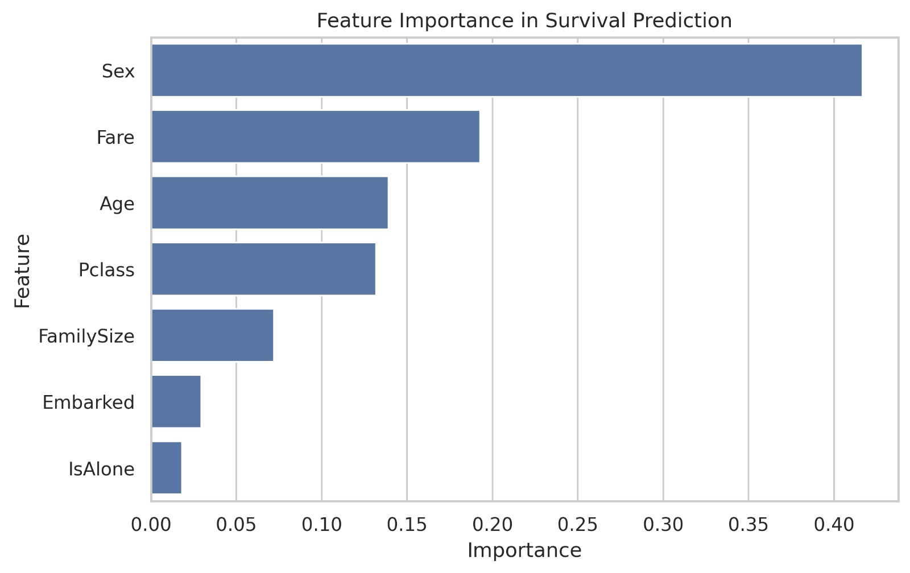
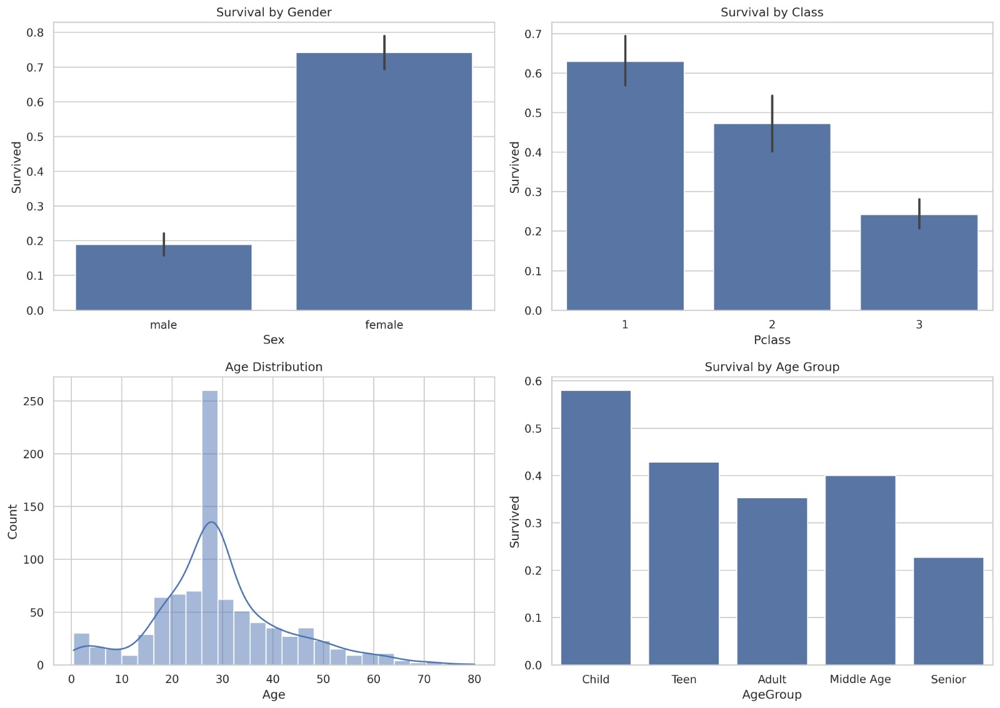
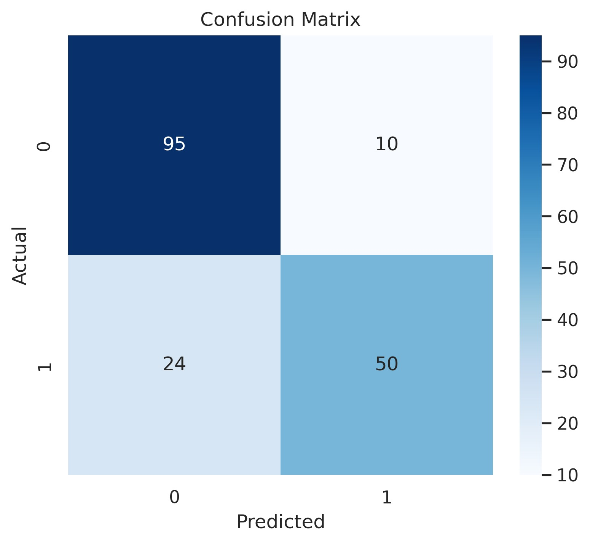

# Titanic Survival Analytics and Explainable Machine Learning Prediction System

## Project Overview
This project predicts whether a Titanic passenger survived or not using Machine Learning techniques.

## Objectives
- Analyze passenger survival patterns
- Perform Exploratory Data Analysis (EDA)
- Build a Machine Learning model
- Explain important factors affecting survival

## Technologies Used
- Python
- Pandas
- NumPy
- Matplotlib
- Seaborn
- Scikit-Learn
- Jupyter Notebook

## Features
- Data Cleaning
- Feature Engineering
- Survival Analysis
- Random Forest Classification
- Feature Importance Analysis
- Confusion Matrix Evaluation

## Results

### Survival Analysis

### Feature Importance

### Confusion Matrix

## Author
Bhanu Sandhya
